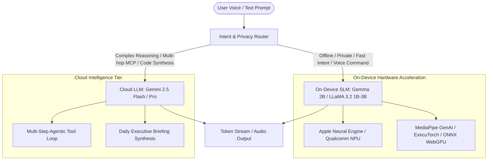
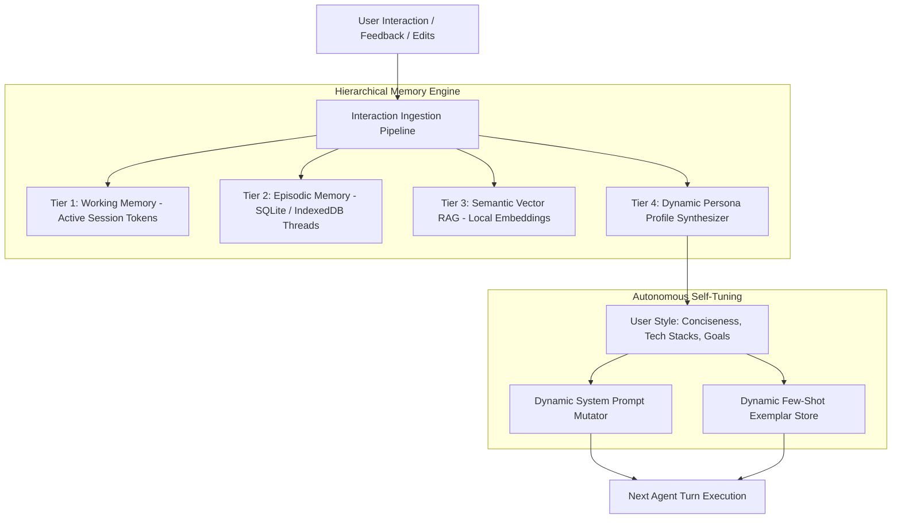
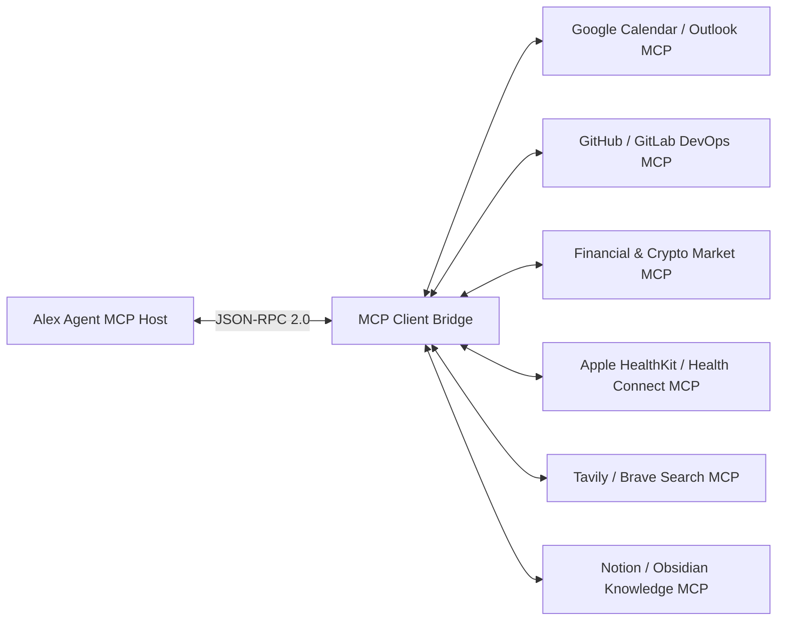
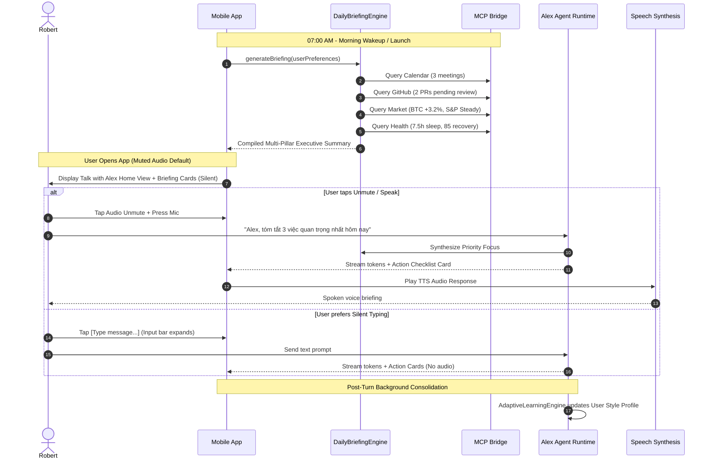

# Alex Personal AI Agent — Technical Architecture & Operational Roadmap

**Project:** Daily Mastery (Mobile & Ecosystem)  
**Agent Persona:** Alex (Personal Co-pilot for Robert)  
**Status:** Architecture Blueprint v2.0  
**Target Environments:** Mobile (iOS / Android Capacitor), Web Workbench & MCP Bridge  

---

## 1. Executive Summary

Alex is an autonomous **Personal AI Agent** designed to assist Robert in daily productivity, software engineering, technical communication, financial strategy, and 180-day habit mastery.

The system is built on four architectural pillars:
1. **Voice & Briefing First Interface**: Muted-by-default audio ergonomics, interactive soundwave stage, multi-pillar executive briefings, and a frictionless show/hide text input bar.
2. **Intelligent On-Device & Cloud Hybrid Architecture**: Zero-latency edge execution via Small Language Models (Gemma 2B / LLaMA 3.2 1B–3B on NPU/GPU) with cloud fallback for heavy multi-hop reasoning (Gemini 2.5 Flash / Pro).
3. **Continuous Auto-Learning & Memory System**: Hierarchical memory (Working, Episodic, Semantic Local RAG, and Dynamic Persona Profile) that learns Robert's habits, tone, and preferences automatically.
4. **Model Context Protocol (MCP) Ecosystem**: Standardized JSON-RPC 2.0 integration connecting Workspace tools, GitHub repositories, financial market feeds, Apple HealthKit, and live web search.

---

## 2. AI Model Selection & Edge/Cloud Hybrid Strategy

### 2.1 Model Evaluation Matrix

| Model Identifier | Parameters | Quantization | RAM / VRAM | Engine Runtime | Latency (TTFT) | Tok/s (Mobile) | Primary Use Case |
| :--- | :--- | :--- | :--- | :--- | :--- | :--- | :--- |
| **Gemma 2B / 2.6B / 3B** | 2.0B – 2.6B | INT4 (AWQ/GGUF) | ~1.4 – 1.8 GB | MediaPipe GenAI / LiteRT | ~80 – 120 ms | 35 – 55 tok/s | Offline voice command, local intent parsing, quick summaries |
| **LLaMA 3.2 (1B / 3B)** | 1.2B – 3.2B | INT4 / Q4_K_M | ~0.9 – 2.1 GB | ExecuTorch / llama.cpp | ~70 – 110 ms | 40 – 60 tok/s | On-device tool calling, local task classification |
| **Qwen 2.5 (1.5B / 3B)** | 1.5B – 3.1B | INT4 (GGUF) | ~1.1 – 2.0 GB | ONNX Runtime Mobile / Metal | ~90 – 130 ms | 30 – 50 tok/s | Strong Vietnamese + English bilingual code & math |
| **Phi-3.5 mini (3.8B)** | 3.8B | INT4 | ~2.4 GB | ONNX Runtime Mobile | ~120 – 180 ms | 20 – 35 tok/s | High-density reasoning on high-end devices |
| **Gemini 2.5 Flash (Cloud)**| Multi-MoE | Cloud FP16 | 0 MB (Remote) | Google GenAI SDK | ~150 – 250 ms | 80 – 140 tok/s | Daily briefing synthesis, MCP orchestration, live search |
| **Gemini 1.5 Pro (Cloud)** | 1M+ Context | Cloud FP16 | 0 MB (Remote) | Google GenAI SDK | ~350 – 500 ms | 50 – 90 tok/s | Deep architectural reviews, full repo diff audits |

### 2.2 Why a Hybrid Model is Optimal

1. **Battery & Thermals**: Running 7B+ models continuously on mobile drains battery within 1–2 hours. A hybrid architecture runs small 1B–2B models for instant classification/UI updates and dispatches complex tasks to cloud engines.
2. **Privacy**: Personal notes, health stats, and private voice transcripts can be processed purely on-device without cloud egress.
3. **Availability**: Full offline functionality for daily habits, streak tracking, and cached lessons when commuting or without internet.

---

## 3. Continuous Learning & Self-Adaptation Architecture

Rather than performing full backpropagation on the device (which is slow, battery-draining, and prone to catastrophic forgetting), Alex uses a **Hierarchical Continual Learning System** inspired by Mem0, LangMem, and Dynamic In-Context Adaptation:

### 3.1 The 4 Memory Tiers

1. **Tier 1: Working Memory (Session Context)**:
   - Stores active conversation turn tokens, recent tool results, and temporary scratchpad state.
   - Includes real-time compression to keep context window lean.
2. **Tier 2: Episodic Memory (Conversation Logs & Events)**:
   - Persisted in SQLite / IndexedDB (`dm_agent_threads`).
   - Indexed by channel, timestamp, and topic tags.
3. **Tier 3: Semantic Vector RAG (Personal Knowledge Base)**:
   - On-device embedding index (using lightweight 384-dim embeddings like MiniLM or Gecko).
   - Indexes Robert's past coding snippets, notes, architecture decisions, and lesson flashcards.
4. **Tier 4: Dynamic Persona Profile (Self-Learning Profile)**:
   - Background worker analyzes user corrections (e.g. "Alex, make it shorter", "I prefer Go over Python for this microservice").
   - Automatically updates `MemoryStore.profile` with:
     - Communication style: `concise_direct`, `code_first`, `no_filler`.
     - Technical preferences: `Docker`, `PostgreSQL`, `Vue 3`, `Clean Architecture`.
     - Active project priorities & lifestyle habits.

---

## 4. Model Context Protocol (MCP) Ecosystem

Alex acts as an **MCP Host** using the standard Model Context Protocol over JSON-RPC 2.0. This allows Alex to connect to real-world systems securely.

### 4.1 Connected MCP Servers

| MCP Server | Server Name | Core Tools & Resources Exposed | Typical Use in Alex |
| :--- | :--- | :--- | :--- |
| **Workspace** | `mcp/workspace` | `get_calendar_events`, `create_meeting`, `list_reminders` | Morning agenda check, scheduling study sessions |
| **GitHub DevOps** | `mcp/github` | `list_pull_requests`, `get_commit_history`, `search_code`, `create_issue` | Daily PR review alerts, tracking repo changes |
| **Market Feeds** | `mcp/market` | `get_asset_quote`, `get_market_sentiment`, `get_macro_indices` | Daily financial market intelligence (BTC, S&P 500) |
| **Health & Life** | `mcp/health` | `get_sleep_metrics`, `get_activity_summary`, `get_focus_time` | Energy rhythm analysis, recovery score briefing |
| **Live Web Search**| `mcp/websearch` | `search_web`, `extract_article_content` | Real-time tech radar, documentation lookup |
| **Notes & PKM** | `mcp/notes` | `search_notes`, `append_note`, `query_vault` | Notion/Obsidian bi-directional synchronization |

---

## 5. Operational Lifecycle & Daily Briefing Pipeline

---

## 6. Security, Privacy & Implementation Roadmap

1. **Local-First Data Storage**: All conversation threads, user habit vectors, and notes remain in encrypted local storage (`Capacitor Preferences` / `SecureStorage`).
2. **Credential Masking**: API keys and OAuth tokens are stored in device Keychain/Keystore and never exposed in logs or UI templates.
3. **Extensibility**: Third-party MCP servers can be plugged in via standard WebSocket or SSE endpoints without recompiling the mobile app.
