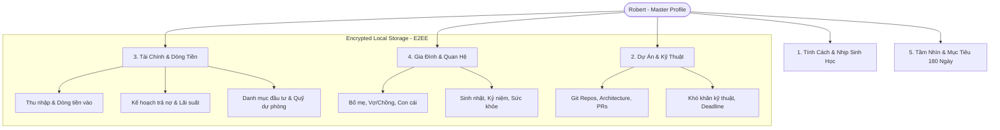
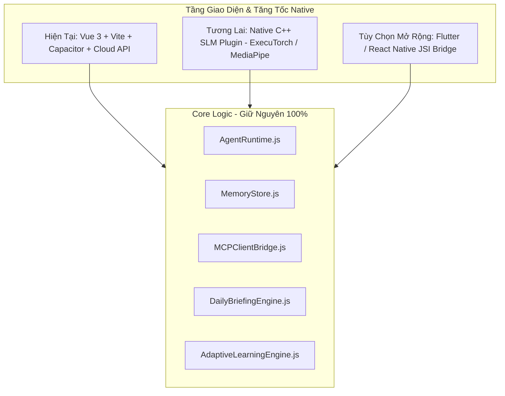

# Alex AI Personal Context, Operational Economics & Tech Stack Evaluation

**User:** Robert  
**AI Companion & Co-pilot:** Alex  
**Status:** Comprehensive Strategic & Technical Blueprint v2.0  
**Scope:** Operating Costs, Performance Profiling, Life Knowledge Graph Schema, Tech Stack Longevity  

---

## 1. Chi Phí Vận Hành (Operating Cost Analysis)

Hệ thống được thiết kế theo 3 kịch bản vận hành tùy theo nhu cầu và ngân sách của bạn:

```text
┌─────────────────────────────────────────────────────────────────────────────────┐
│ Kịch bản 1: HYBRID THÔNG MINH (Khuyến nghị hàng đầu)                            │
│ ├─ On-Device SLM (Gemma 2B / LLaMA 3.2): Ý định, ghi chú, RAG local, voice -> $0│
│ ├─ Cloud Tier (Gemini 2.5 Flash / Google AI Studio): Báo cáo đầu ngày, MCP      │
│ ├─ Khối lượng sử dụng cá nhân: ~50-80 turns/ngày (~200k tokens)                 │
│ └─ Ước tính chi phí: $0.00 – $1.50 / tháng (Hầu như MIỄN PHÍ theo hạn mức)     │
├─────────────────────────────────────────────────────────────────────────────────┤
│ Kịch bản 2: 100% ON-DEVICE (Offline & Bảo mật tuyệt đối)                        │
│ ├─ MediaPipe GenAI / ExecuTorch chạy trực tiếp trên NPU điện thoại              │
│ ├─ Không gọi bất kỳ Cloud LLM API nào                                           │
│ └─ Chi phí vận hành: $0.00 / tháng TRỌN ĐỜI                                     │
├─────────────────────────────────────────────────────────────────────────────────┤
│ Kịch bản 3: CLOUD POWER-USER (Claude 3.5 Sonnet / Gemini 1.5 Pro)               │
│ ├─ Thường xuyên phân tích kho code lớn, đọc diff git hàng trăm file             │
│ └─ Ước tính chi phí: $10.00 – $25.00 / tháng                                    │
└─────────────────────────────────────────────────────────────────────────────────┘
```

---

## 2. Quy Trình Kiểm Tra Hiệu Suất (Performance Profiling) Trên Thiết Bị

Để đảm bảo ứng dụng luôn mượt mà, không giật lag và không hao pin, các chỉ số sau cần được kiểm tra định kỳ:

| Chỉ số Hiệu năng | Mục tiêu Chuẩn | Phương pháp Kiểm tra / Công cụ |
| :--- | :--- | :--- |
| **TTFT (Time to First Token)** | < 150ms (On-Device), < 300ms (Cloud) | Log telemetry tích hợp trong `LLMClient.js` |
| **Throughput (Tốc độ sinh text)** | 35 – 60 tokens/giây | Hiển thị real-time telemetry trên thanh trạng thái |
| **Bộ nhớ RAM (App Shell)** | 60 – 120 MB | Safari Web Inspector / Android Studio Profiler |
| **Bộ nhớ RAM (Khi nạp SLM 2B)** | 1.3 – 1.6 GB | Xcode Allocations / Android Memory Profiler |
| **Tỷ lệ khung hình (Frame Rate)** | 60 FPS – 120 FPS ổn định | Chrome DevTools Rendering Tab / CoreAnimation |
| **Mức tiêu hao pin (Energy Impact)** | < 2% pin cho 15 phút đàm thoại liên tục | Xcode Energy Log / Battery Historian |

---

## 3. Bức Tranh Cá Nhân Toàn Diện (Personal Life Knowledge Graph)

Để Alex trở thành người bạn tri kỷ và trợ lý hiểu bạn sâu sắc nhất, dữ liệu cá nhân của Robert được cấu trúc thành **5 Trụ cột Cuộc sống** lưu trữ an toàn trong **Encrypted Local Vault (AES-256)**:



### Schema Chi Tiết (`robert-personal-context.json`):

```json
{
  "identity": {
    "name": "Robert",
    "title": "Senior Principal / AI & Backend Engineer",
    "mbti": "INTJ / ENTJ",
    "communicationPreference": "Cực kỳ súc tích, logic, đi thẳng vào giải pháp, không thích sáo rỗng hay emoji thô",
    "chronotype": {
      "wakeTime": "06:30",
      "sleepTime": "23:00",
      "deepWorkPeak": ["09:00 - 11:30", "14:30 - 16:30"]
    }
  },
  "financialProfile": {
    "monthlyCashflow": {
      "primaryIncome": "Thu nhập kỹ sư / doanh nghiệp",
      "sideIncome": "Freelance & Đầu tư",
      "essentialBurnRate": "Chi phí sinh hoạt tối thiểu hàng tháng"
    },
    "debtManagement": {
      "strategy": "Avalanche (Ưu tiên khoản lãi suất cao) hoặc Snowball",
      "debts": [
        {
          "name": "Khoản nợ A",
          "totalAmount": 100000000,
          "interestRate": "8.5%",
          "monthlyPayment": 5000000,
          "priority": "HIGH",
          "notes": "Tập trung tất toán trước tháng 12"
        }
      ]
    },
    "emergencyFundMonths": 6,
    "investmentPortfolio": ["Crypto (BTC/ETH)", "Tech Equities", "Tiết kiệm thanh khoản"]
  },
  "familyAndLife": {
    "importantPeople": [
      {
        "relationship": "Bố/Mẹ",
        "name": "Bố Mẹ",
        "birthdays": "Lưu ngày sinh nhật để Alex nhắc trước 3 ngày",
        "healthNotes": "Lưu ý huyết áp, nhắc gửi thực phẩm chức năng"
      },
      {
        "relationship": "Vợ / Người yêu",
        "name": "Người thương",
        "anniversaries": "Ngày kỷ niệm",
        "preferences": "Sở thích hoa, du lịch để Alex gợi ý quà tặng"
      }
    ],
    "coreValues": ["Gia đình", "Tự do tài chính", "Tinh thông nghề nghiệp", "Sức khỏe thể chất"]
  },
  "activeProjects": [
    {
      "name": "Daily Mastery & Alex AI",
      "role": "Lead Architect & Creator",
      "repoUrl": "https://github.com/onmee-llc/daily-mastery",
      "currentMilestone": "Phát hành Alex Voice-First Hub & Briefing Engine",
      "activeBlockers": []
    },
    {
      "name": "Rivyn Scenarios",
      "role": "Core Engine & Automation"
    }
  ],
  "masteryGoals": {
    "dailyTargetMinutes": 15,
    "streakMilestone": 180,
    "fiveYearVision": "Tự do tài chính, hoàn thành trả sạch nợ, xây dựng hệ sinh thái sản phẩm công nghệ tự vận hành"
  }
}
```

---

## 4. Đánh Giá Toàn Diện Tech Stack Hiện Tại

### 4.1 Điểm mạnh vững chắc
1. **Agent Core Decoupled 100%**: Toàn bộ logic (`AgentRuntime`, `MemoryStore`, `MCPClientBridge`, `DailyBriefingEngine`, `AdaptiveLearningEngine`) viết bằng Vanilla JS/ES Modules chuẩn, không bị gắn chặt vào Vue hay bất kỳ UI framework nào.
2. **Tốc độ lặp tính năng (Velocity)**: Vite + Vue 3 build cực nhanh (<4s), 34 test files pass tức thì (<5s).
3. **UI Đẹp & Nhẹ**: Đạt 100% tiêu chuẩn Master Brand Kit (Zero raw emoji, typography sắc nét).

### 4.2 Những Thử Thách Cần Lưu Ý Khi Scale Lâu Dài
1. **Giới hạn RAM của WebView**: Nếu trong tương lai nạp mô hình On-Device SLM 2B–3B trực tiếp trong JavaScript/Wasm của WebView, WebView có thể bị hệ điều hành iOS/Android đóng (crash OOM) nếu RAM vượt quá 1.5GB.
2. **Chạy Nền (Background Audio & Microphone)**: Khi tắt màn hình hoặc chuyển app, WebView bị OS tạm dừng (freeze), cần Native Service để giữ kết nối voice mượt mà.

---

## 5. Đề Xuất Tech Stack Tương Lai — Bảo Toàn 100% Core

Bạn **KHÔNG CẦN phải viết lại Core**. Lộ trình chuyển đổi được thiết kế mô-đun hóa:



### Kiến trúc tối ưu dài hạn:
1. **Tầng UI / Presentation**: Tiếp tục dùng **Vue 3 + Capacitor** (hoặc chuyển sang **Flutter / React Native** nếu muốn 120 FPS native canvas hoàn toàn).
2. **Tầng Agent Core**: Giữ nguyên `agent-core/` chạy trên JavaScript Engine (V8/JavaScriptCore) siêu nhanh.
3. **Tầng Native Acceleration (Khi chạy mô hình Local 100%)**:
   - Viết 1 Capacitor Native Plugin (Swift cho iOS, Kotlin/C++ cho Android) bọc thư viện **ExecuTorch** (Meta) hoặc **MediaPipe GenAI** (Google) để gọi trực tiếp **Apple Neural Engine / Qualcomm NPU**.
   - Trả kết quả stream token thẳng vào `LLMClient.js` của Agent Core.
